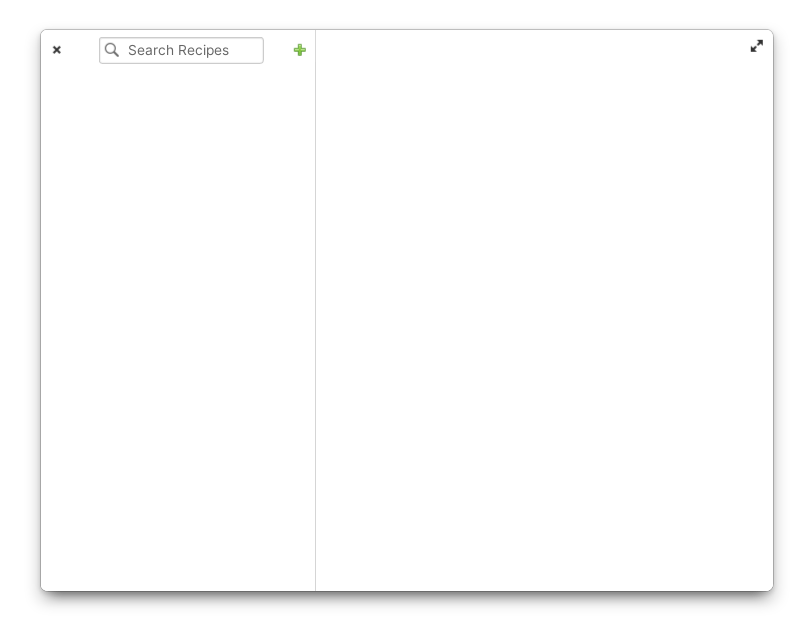

# Sous-chef

Your trusted kitchen companion.

A recipes app based on [RecipeMD](https://github.com/tstehr/RecipeMD) specification made for [elementary OS](https://elementary.io/).



## How to build from source

### Flatpak

You may need to install elementary flatpak runtime first. You can do that with:

```sh
flatpak install --user io.elementary.Sdk//7
```

To install Sous-chef use `flatpak-builder`, from project root directory run:

```sh
flatpak-builder build hr.from.josipantolis.souschef.yml --user --install --force-clean
```

then run the app with full logging enabled by executing:

```sh
flatpak --env=G_MESSAGES_DEBUG=all run hr.from.josipantolis.souschef
```

You can uninstall the app and remove its associated data with:

```sh
flatpak uninstall hr.from.josipantolis.souschef --delete-data
```

## License

[GNU GPLv3](COPYING)

Copyright © 2022 Josip Antoliš, josip.antolis@protonmail.com.
