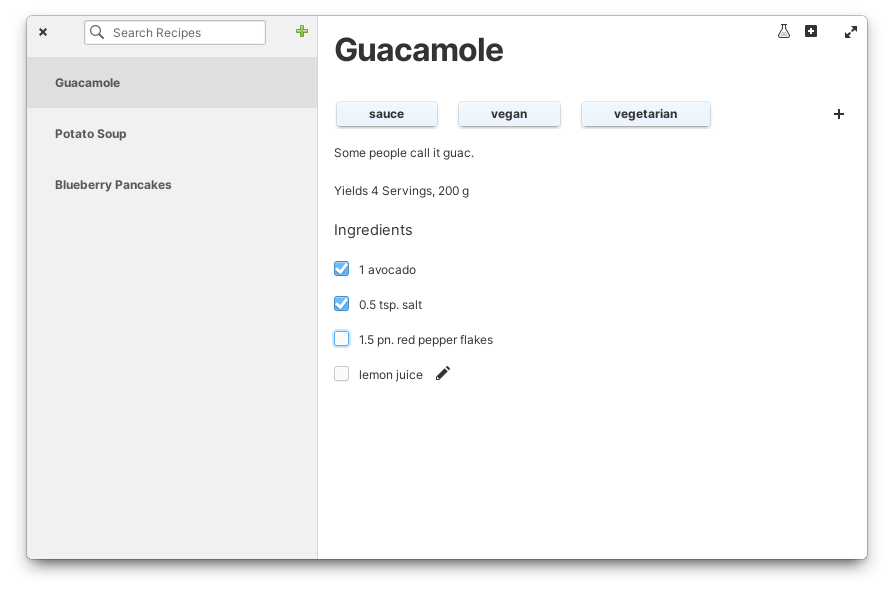
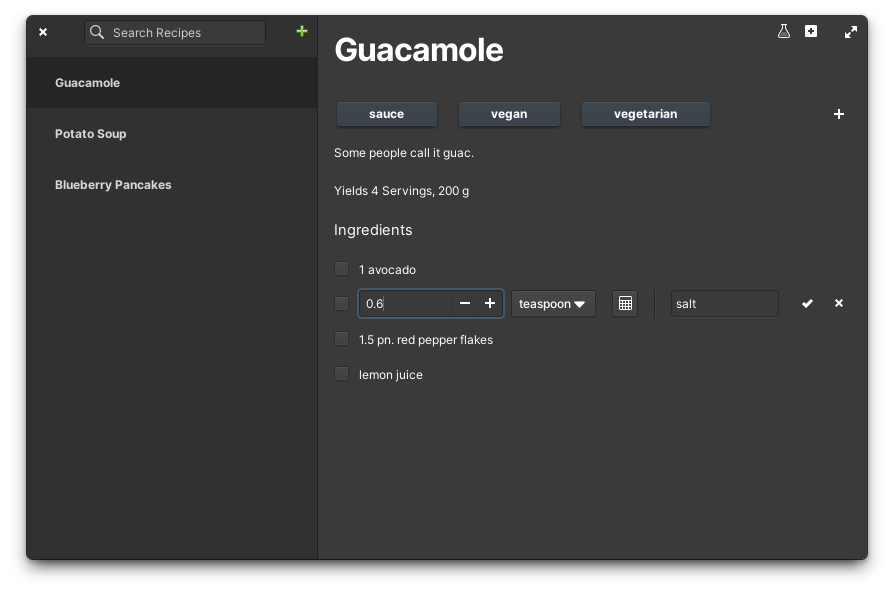

# Sous-chef

Your trusted kitchen companion.

A recipes app based on [RecipeMD](https://github.com/tstehr/RecipeMD) specification made for [elementary OS](https://elementary.io/).

| | |
|------------------------------------------------------------------------|------------------------------------------------------------------|
| Reading a recipe, showcasing the default style                         | Editing recipe ingredients, showcasing the dark style            |

## How to build from source

### Flatpak

You may need to install elementary flatpak runtime first. You can do that with:

```sh
flatpak install --user io.elementary.Sdk//7.2
```

To install Sous-chef use `flatpak-builder`, from project root directory run:

```sh
flatpak-builder build hr.from.josipantolis.souschef.yml --user --install --force-clean
```

then run the app with full logging enabled by executing:

```sh
flatpak --env=G_MESSAGES_DEBUG=all run hr.from.josipantolis.souschef
```

You can uninstall the app and remove its associated data with:

```sh
flatpak uninstall hr.from.josipantolis.souschef --delete-data
```

### Meson

You can also build Sous-chef using the meson build system. In this case you'll need to install its dependencies locally:

- libcmark-dev
- libgranite-7-dev
- libsqlite3-dev
- libgtk-4-dev
- meson
- valac

Run `meson build` to configure the build environment and then change to the build directory and run `ninja` to build

```sh
meson build --prefix=/usr
cd build
ninja
```

To install, use `ninja install`, then execute with `hr.from.josipantolis.souschef`

```sh
ninja install
G_MESSAGES_DEBUG=all ./hr.from.josipantolis.souschef
```

To run tests, use `ninja test`.

## License

[GNU GPLv3](COPYING)

Copyright © 2022 Josip Antoliš, josip.antolis@protonmail.com.
